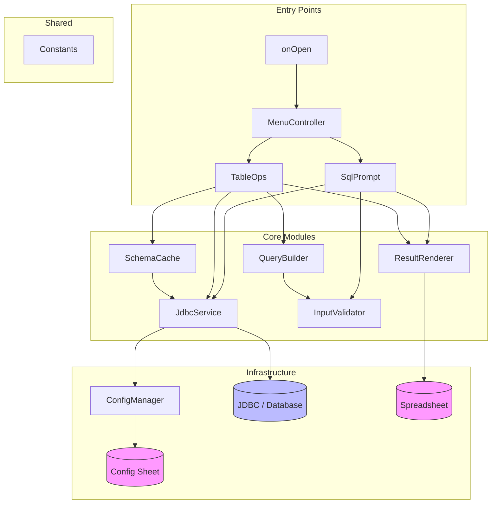
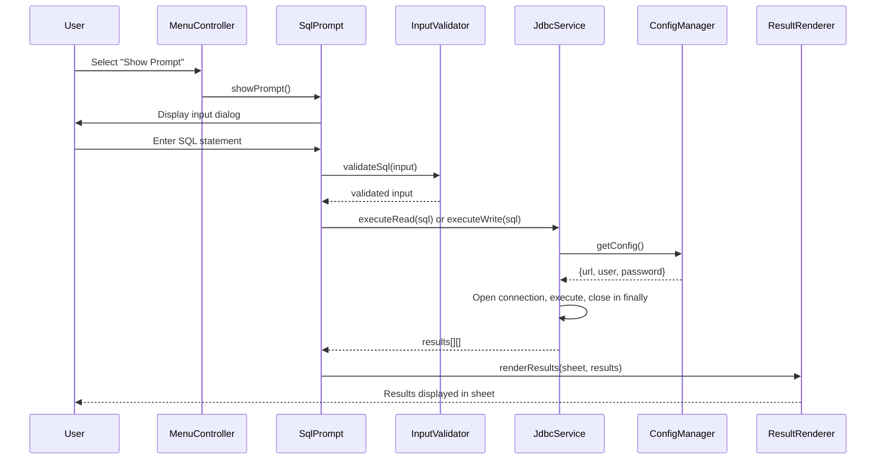
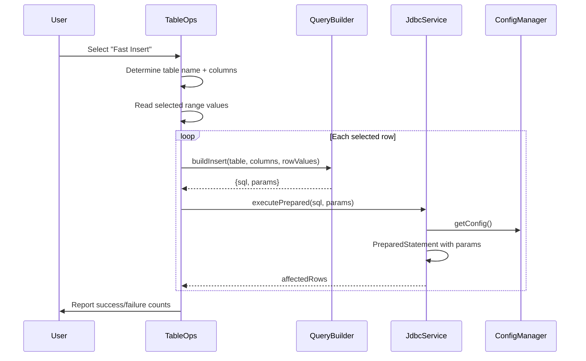

# Design Document

## Overview

This design describes the architectural rebuild of SheetDB, a Google Sheets Add-on that connects spreadsheets to remote SQL databases via JDBC. The rebuild replaces the current monolithic codebase with a modular architecture of focused, single-responsibility modules while preserving full backward compatibility (including the "Configue" sheet name).

### Goals

- Eliminate code duplication (the current `SQL()` and `SQLHelp()` functions both manage JDBC connections independently)
- Replace string-concatenated SQL with parameterized queries for bulk operations
- Replace the fragile bold-cell formatting convention for Fast Update column selection with an explicit dialog-based mechanism
- Introduce proper error handling with resource cleanup guarantees
- Isolate pure business logic into testable modules that run under Node.js without Apps Script stubs
- Organize source files by responsibility so each module has a clear API surface

### Non-Goals

- Migrating away from Apps Script or JDBC
- Adding new database features beyond what the current add-on supports
- Changing the user-facing menu structure or workflow
- Supporting multiple simultaneous database connections

### Key Design Decisions

1. **Plain JS modules over classes**: Apps Script V8 supports classes, but the existing codebase uses function-level organization. We continue with `var` declarations and plain functions to stay consistent and avoid unnecessary migration risk.

2. **PreparedStatement for bulk ops only**: Interactive SQL prompt must accept arbitrary user SQL, so it continues using `Statement.executeQuery/executeUpdate`. Bulk operations (Fast Insert/Update/Delete) switch to `PreparedStatement` for safety.

3. **Dialog-based column selection for Fast Update**: The current bold-cell convention is fragile (any edit triggers `onEdit` which bolds cells). The rebuild replaces this with a checkbox dialog that lets users explicitly choose which columns to update.

4. **Schema cache is script-execution scoped**: Apps Script has no persistent in-memory state across invocations. The cache lives in a module-level variable and is valid only for the duration of a single menu-action execution.

## Architecture

### High-Level Module Diagram



### Data Flow: SQL Prompt Execution



### Data Flow: Bulk Insert



## Components and Interfaces

### Constants (`src/Constants.gs`)

Centralizes all magic strings. No dependencies on Apps Script APIs.

```javascript
// Sheet names
var SHEET_NAME_CONFIG = 'Configue';   // backward compat
var SHEET_NAME_SQL    = 'SQL';

// Menu labels
var MENU_SQL           = 'SQL';
var MENU_TABLE         = 'Table';
var MENU_SHOW_PROMPT   = 'Show Prompt';
var MENU_REFRESH       = 'Refresh';
var MENU_CLEAR_HISTORY = 'Clear History';
var MENU_CONFIGURE     = 'Configure';
var MENU_LOAD_TABLES   = 'Load Tables';
var MENU_REFRESH_TABLE = 'Refresh Table';
var MENU_DROP_TABLE    = 'Drop Table';
var MENU_FAST_INSERT   = 'Fast Insert';
var MENU_FAST_UPDATE   = 'Fast Update';
var MENU_FAST_DELETE   = 'Fast Delete';

// JDBC
var JDBC_TIMEOUT_SECONDS = 30;

// UI strings
var CANCEL_BUTTON_VALUE = 'cancel';
var MSG_CONFIGURE_FIRST = 'Please configure the system first!';
```

### InputValidator (`src/InputValidator.gs`)

Pure functions — no Apps Script dependencies. Testable under Node.js.

| Function | Signature | Description |
|---|---|---|
| `validateSql` | `(input: string) → string` | Trims input; throws if empty/whitespace-only. Returns trimmed SQL. |
| `classifySql` | `(sql: string) → 'read' \| 'write'` | Returns `'read'` for SELECT/SHOW/DESCRIBE, `'write'` for everything else. Based on first keyword. |
| `isCancel` | `(value: any) → boolean` | Returns `true` if value is the cancel button sentinel. |

### QueryBuilder (`src/QueryBuilder.gs`)

Pure functions for SQL construction. No Apps Script dependencies except `Utilities.formatDate` for Date quoting (isolated behind a formatter parameter for testability).

| Function | Signature | Description |
|---|---|---|
| `quoteSqlValue` | `(value, formatDateFn?) → string` | Quotes a value for SQL. NULL for null/empty, numeric literal for numbers, escaped+quoted for strings, formatted+quoted for Dates. |
| `buildInsertSql` | `(table, columns, values) → {sql, params}` | Returns parameterized INSERT with `?` placeholders and param array. |
| `buildUpdateSql` | `(table, columns, values, setCols, whereCols) → {sql, params}` | Returns parameterized UPDATE. `setCols` indices become SET clause; `whereCols` indices become WHERE clause. |
| `buildDeleteSql` | `(table, columns, values, whereCols) → {sql, params}` | Returns parameterized DELETE with WHERE clause from specified columns. |
| `parseQuotedValue` | `(quoted: string) → any` | Inverse of `quoteSqlValue`: parses a SQL literal back to a JS value. Used for round-trip testing. |

### ConfigManager (`src/ConfigManager.gs`)

Manages the Config_Sheet. Depends on `SpreadsheetApp`.

| Function | Signature | Description |
|---|---|---|
| `getConfigSheet` | `() → Sheet` | Returns the Config_Sheet, creating it with labeled rows if absent. |
| `getConfig` | `() → {url, user, password}` | Reads credentials from Config_Sheet. |
| `hasValidConfig` | `(config) → boolean` | Returns true if all three credential fields are non-empty strings. |
| `saveConfig` | `(url, user, password) → void` | Writes credentials to Config_Sheet. |
| `runConfigDialog` | `() → boolean` | Prompts user for URL, username, password in sequence. Returns false if cancelled at any step. |

### JdbcService (`src/JdbcService.gs`)

Single module for all JDBC operations. Depends on `Jdbc` and `ConfigManager`.

| Function | Signature | Description |
|---|---|---|
| `executeRead` | `(sql: string) → string[][]` | Opens connection, executes query, returns array of row arrays. Closes all resources in finally. |
| `executeWrite` | `(sql: string) → number` | Opens connection, executes update, returns affected row count. Closes all resources in finally. |
| `executePrepared` | `(sql: string, params: any[]) → number` | Opens connection, creates PreparedStatement, binds params, executes update. Closes all resources in finally. |
| `getConnection_` | `() → JdbcConnection` | Internal. Gets config, opens connection, sets statement timeout. Throws with context on failure. |

All public functions throw errors with the original message and the failing SQL statement attached. Close errors in finally blocks are suppressed (logged but not re-thrown).

### SchemaCache (`src/SchemaCache.gs`)

In-memory cache for table column metadata. Valid for one script execution.

| Function | Signature | Description |
|---|---|---|
| `getColumns` | `(tableName: string) → string[]` | Returns cached column names, or fetches via `DESCRIBE` and caches. |
| `invalidate` | `(tableName?: string) → void` | Clears cache for one table or all tables. |

```javascript
var schemaCache_ = {};  // module-level, reset each execution
```

### ResultRenderer (`src/ResultRenderer.gs`)

Writes query results to spreadsheet cells. Depends on `SpreadsheetApp`.

| Function | Signature | Description |
|---|---|---|
| `renderReadResults` | `(sheet, sql, rows) → void` | Writes status row (sql + " Success"), then header + data rows. Appends blank separator row. |
| `renderWriteResult` | `(sheet, sql) → void` | Writes status row (sql + " Success") and blank separator. |
| `renderNoResults` | `(sheet, sql) → void` | Writes status row indicating zero results. |
| `replaceResultBlock` | `(sheet, startRow, newRows) → void` | For Refresh: finds the old result block boundaries, deletes old rows, inserts new rows in place. |

### SqlPrompt (`src/SqlPrompt.gs`)

Handles the SQL prompt dialog, refresh, and clear history. Depends on `JdbcService`, `InputValidator`, `ResultRenderer`.

| Function | Signature | Description |
|---|---|---|
| `showPrompt` | `() → void` | Shows input dialog, validates, executes, renders results. |
| `refresh` | `() → void` | Re-executes SQL from selected cell, replaces result block in place. |
| `clearHistory` | `() → void` | Confirms with user, then clears active sheet. |

### TableOps (`src/TableOps.gs`)

Handles table loading, refresh, drop, and bulk operations. Depends on `JdbcService`, `QueryBuilder`, `SchemaCache`, `ConfigManager`.

| Function | Signature | Description |
|---|---|---|
| `loadTables` | `() → void` | Fetches table list, creates/refreshes Table_Sheets. |
| `refreshTable` | `() → void` | Reloads schema + data for current or prompted table. |
| `dropTable` | `() → void` | Drops table via SQL, removes sheet. |
| `fastInsert` | `() → void` | Builds parameterized INSERTs from selected range, executes, reports results. |
| `fastUpdate` | `() → void` | Shows column-selection dialog, builds parameterized UPDATEs, executes, reports results. |
| `fastDelete` | `() → void` | Builds parameterized DELETEs from selected range, executes, removes sheet rows on success, reports results. |

### MenuController (`src/MenuController.gs`)

Registers menus on spreadsheet open. Depends on `SpreadsheetApp` and constants.

| Function | Signature | Description |
|---|---|---|
| `onOpen` | `() → void` | Registers SQL and Table menus using constant labels. Routes each item to the appropriate handler function. |

### Utility Helpers (`src/Helpers.gs`)

Shared helpers that depend on Apps Script APIs.

| Function | Signature | Description |
|---|---|---|
| `ensureSheet` | `(name: string) → Sheet` | Returns existing sheet or creates a new one. |
| `ensureSqlSheet` | `() → Sheet` | Shorthand for `ensureSheet(SHEET_NAME_SQL)`. |
| `appendSqlHistory` | `(rows: any[][]) → void` | Appends rows to the SQL history sheet. |
| `requireConfig` | `() → {url, user, password}` | Gets config; shows error dialog and throws if not configured. |

## Data Models

### Configuration

```
Config {
  url:      string   // JDBC URL, e.g. "jdbc:mysql://host:3306/db"
  user:     string   // Database username
  password: string   // Database password
}
```

Stored in the Config_Sheet ("Configue") as:
| Row | Column A (label) | Column B (value) |
|-----|-----------------|-------------------|
| 1   | URL             | jdbc:mysql://...  |
| 2   | Admin           | root              |
| 3   | Password        | ****              |

### Schema Cache Entry

```
SchemaCache {
  [tableName: string]: string[]   // column names array
}
```

Module-level variable, reset on each script execution.

### Query Builder Output

```
PreparedQuery {
  sql:    string   // SQL with ? placeholders, e.g. "INSERT INTO t (a,b) VALUES (?,?)"
  params: any[]    // Parameter values in placeholder order
}
```

### SQL Classification

```
SqlType = 'read' | 'write'

Read keywords:  SELECT, SHOW, DESCRIBE
Write keywords: INSERT, UPDATE, DELETE, DROP, CREATE, ALTER (everything else)
```

### Result Structures

```
ReadResult:  string[][]   // Array of row arrays from ResultSet
WriteResult: number       // Affected row count from executeUpdate
```

### Bulk Operation Report

```
BulkReport {
  total:     number   // Total rows attempted
  succeeded: number   // Rows that completed without error
  failed:    number   // Rows that threw an error
  errors:    string[] // Error messages for failed rows
}
```

## Correctness Properties

*A property is a characteristic or behavior that should hold true across all valid executions of a system — essentially, a formal statement about what the system should do. Properties serve as the bridge between human-readable specifications and machine-verifiable correctness guarantees.*

### Property 1: Value quoting round-trip

*For any* valid JavaScript value (string, number, null, empty string, or Date), calling `quoteSqlValue(value)` and then `parseQuotedValue(result)` SHALL produce a value equivalent to the original input. This subsumes correct quoting of strings (with single-quote escaping), numeric literals, NULL representation, and Date formatting.

**Validates: Requirements 3.3, 3.4, 3.5, 3.6, 3.7, 14.5**

### Property 2: Whitespace SQL rejection

*For any* string composed entirely of whitespace characters (spaces, tabs, newlines, carriage returns, or any combination thereof), `validateSql(input)` SHALL throw a descriptive error and never return a value.

**Validates: Requirements 3.1**

### Property 3: SQL classification correctness

*For any* SQL string whose first non-whitespace keyword is SELECT, SHOW, or DESCRIBE (case-insensitive), `classifySql(sql)` SHALL return `'read'`. *For any* SQL string whose first keyword is anything else (INSERT, UPDATE, DELETE, DROP, CREATE, ALTER, etc.), `classifySql(sql)` SHALL return `'write'`.

**Validates: Requirements 14.4**

### Property 4: Parameterized query structure

*For any* valid table name, column list, and row of values, the QueryBuilder functions (`buildInsertSql`, `buildUpdateSql`, `buildDeleteSql`) SHALL produce a `PreparedQuery` where: (a) the SQL string contains `?` placeholders and no interpolated user values, and (b) the `params` array length equals the number of `?` placeholders in the SQL string.

**Validates: Requirements 3.2, 7.1, 7.3, 8.1, 8.4, 9.1, 9.3**

### Property 5: Config validation

*For any* config object with `url`, `user`, and `password` fields, `hasValidConfig(config)` SHALL return `true` if and only if all three fields are non-empty strings. If any field is empty, null, undefined, or not a string, it SHALL return `false`.

**Validates: Requirements 2.3, 2.5**

### Property 6: Bulk report accuracy

*For any* sequence of bulk operation outcomes (each either success or failure), the resulting `BulkReport` SHALL have `total === succeeded + failed`, `succeeded` equal to the count of successes, and `failed` equal to the count of failures.

**Validates: Requirements 11.3**

## Error Handling

### Error Propagation Strategy

Errors are handled at two levels:

1. **Low-level (JdbcService)**: Catches JDBC exceptions, wraps them with context (original message + failing SQL), and re-throws. Resource cleanup happens in `finally` blocks regardless of success or failure. Close errors are suppressed (logged to `console.error`) to avoid masking the original operation error.

2. **High-level (SqlPrompt, TableOps)**: Catches errors from JdbcService and displays them to the user via `Browser.msgBox`. These handlers never re-throw — they are the terminal error boundary.

### Error Scenarios

| Scenario | Handler | Behavior |
|---|---|---|
| JDBC connection failure | JdbcService | Throw error with original message + SQL |
| JDBC statement failure | JdbcService | Throw error with original message + SQL |
| Resource close failure | JdbcService | Suppress (log only), preserve original error |
| Empty/whitespace SQL | InputValidator | Throw descriptive error before JDBC call |
| Missing credentials | Helpers.requireConfig | Show "configure first" message, abort operation |
| User cancels dialog | Each handler | Return immediately, no side effects |
| Bulk row failure | TableOps | Log error, increment failure count, continue to next row |
| Table not found | TableOps | Show error message, abort operation |

### Bulk Operation Error Handling

Bulk operations (Fast Insert/Update/Delete) use a continue-on-error strategy:

```javascript
var report = { total: values.length, succeeded: 0, failed: 0, errors: [] };
for (var r = 0; r < values.length; r++) {
  try {
    // execute single row operation
    report.succeeded++;
  } catch (e) {
    report.failed++;
    report.errors.push('Row ' + (r + 1) + ': ' + e.message);
  }
}
// Display summary: "Completed: X succeeded, Y failed"
```

### JDBC Resource Cleanup Pattern

Every JdbcService function follows this pattern:

```javascript
function executeRead(sql) {
  var conn = null, stmt = null, rs = null;
  try {
    conn = getConnection_();
    stmt = conn.createStatement();
    stmt.setQueryTimeout(JDBC_TIMEOUT_SECONDS);
    rs = stmt.executeQuery(sql);
    // ... process results ...
    return results;
  } catch (e) {
    throw new Error('SQL failed [' + sql + ']: ' + e.message);
  } finally {
    try { if (rs) rs.close(); } catch (e) { console.error('close rs: ' + e.message); }
    try { if (stmt) stmt.close(); } catch (e) { console.error('close stmt: ' + e.message); }
    try { if (conn) conn.close(); } catch (e) { console.error('close conn: ' + e.message); }
  }
}
```

## Testing Strategy

### Dual Testing Approach

The testing strategy uses two complementary approaches:

1. **Property-based tests** — verify universal properties across many generated inputs using a PBT library
2. **Example-based unit tests** — verify specific scenarios, edge cases, and integration points

### Property-Based Testing

**Library**: [fast-check](https://github.com/dubzzz/fast-check) (Node.js, well-maintained, good arbitrary generators)

**Configuration**:
- Minimum 100 iterations per property test (`numRuns: 100`)
- Each test tagged with: `Feature: sheetdb-rebuild, Property {N}: {title}`

**Properties to implement**:

| Property | Module Under Test | Generator Strategy |
|---|---|---|
| P1: Value quoting round-trip | QueryBuilder | Generate strings (with special chars, quotes, unicode), numbers (int, float, negative, zero), null, empty string, Date objects |
| P2: Whitespace SQL rejection | InputValidator | Generate strings from whitespace character set (space, tab, \n, \r) of varying lengths |
| P3: SQL classification | InputValidator | Generate SQL strings with random first keywords from read set (SELECT, SHOW, DESCRIBE) and write set (INSERT, UPDATE, DELETE, DROP, CREATE, ALTER) |
| P4: Parameterized query structure | QueryBuilder | Generate random table names (alphanumeric), column name arrays, value arrays of mixed types |
| P5: Config validation | ConfigManager (pure part) | Generate config objects with random combinations of empty/non-empty/null/undefined fields |
| P6: Bulk report accuracy | TableOps (pure part) | Generate random boolean arrays representing success/failure sequences |

### Example-Based Unit Tests

**Focus areas** (not exhaustive):
- `quoteSqlValue`: specific edge cases (null, empty string, string with quotes, Date, zero, negative numbers)
- `validateSql`: empty string, whitespace-only, valid SQL
- `classifySql`: each keyword variant, case sensitivity, leading whitespace
- `isCancel`: cancel value, other values, null, undefined
- `buildInsertSql`: single column, multiple columns, mixed value types
- `buildUpdateSql`: various SET/WHERE column splits
- `buildDeleteSql`: single and multiple WHERE columns

### Test Infrastructure

- **Runner**: Node.js with `fast-check` for property tests, simple assertion functions for unit tests
- **No Apps Script stubs needed**: All tested modules are pure functions with no Apps Script dependencies
- **Date formatting**: `quoteSqlValue` accepts an optional `formatDateFn` parameter so tests can inject a deterministic formatter instead of depending on `Utilities.formatDate`
- **Test command**: `npm test` runs all tests via `node tests/run-tests.js`

### What Is NOT Tested via PBT

The following are tested via example-based or integration tests only:
- Apps Script API interactions (SpreadsheetApp, Browser, Jdbc)
- UI dialog flows (configure, prompt, column selection)
- Sheet rendering (ResultRenderer, table sheet creation)
- Menu registration
- JDBC resource cleanup (verified via mock-based example tests)
- Schema caching behavior (verified via mock-based example tests)

